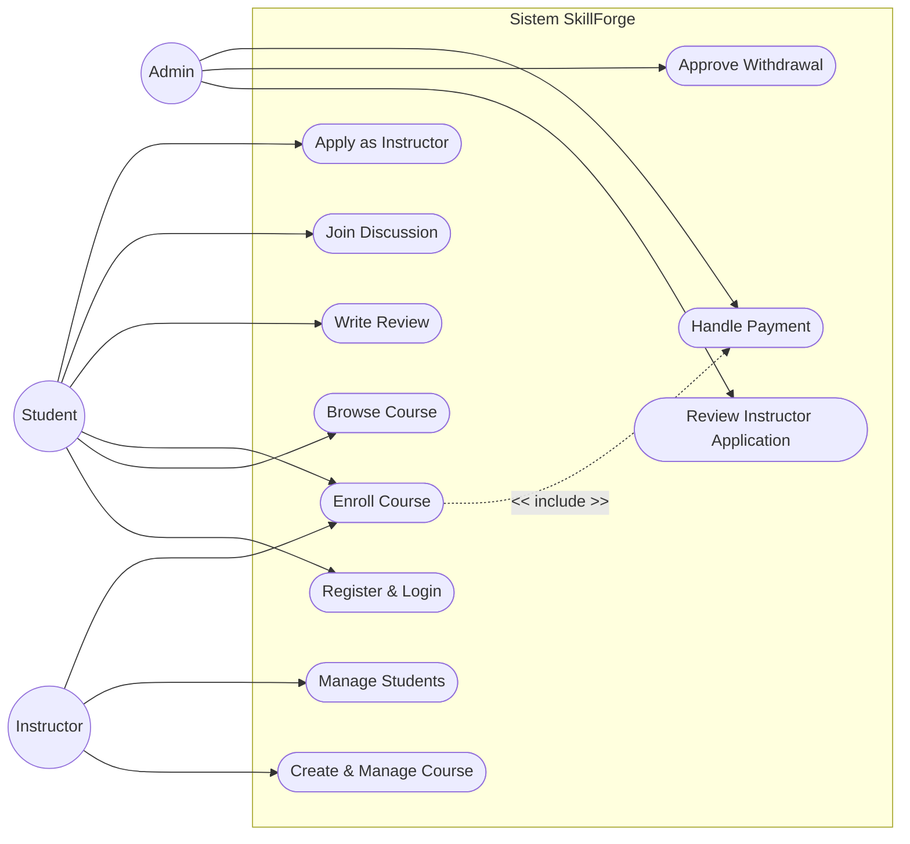
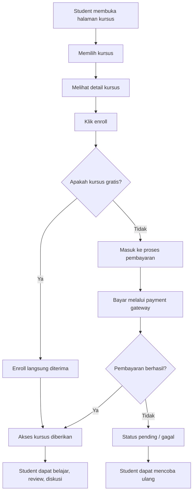
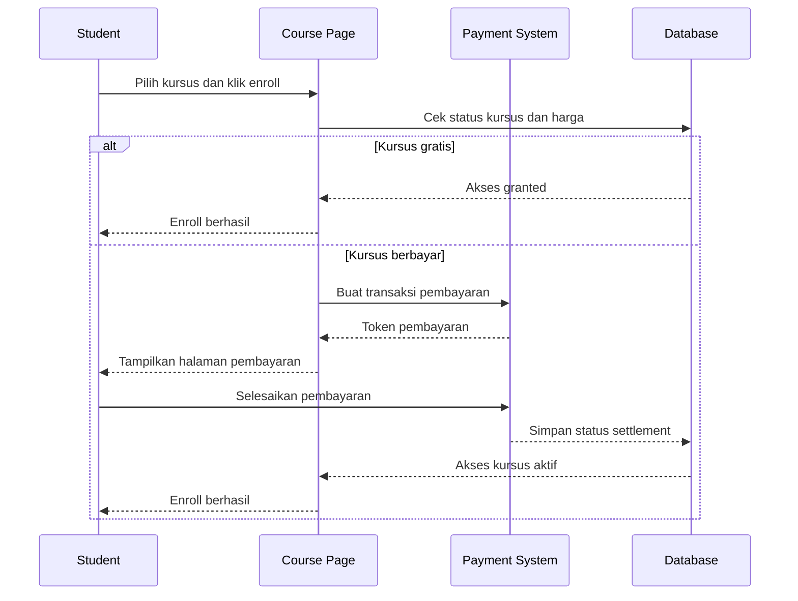
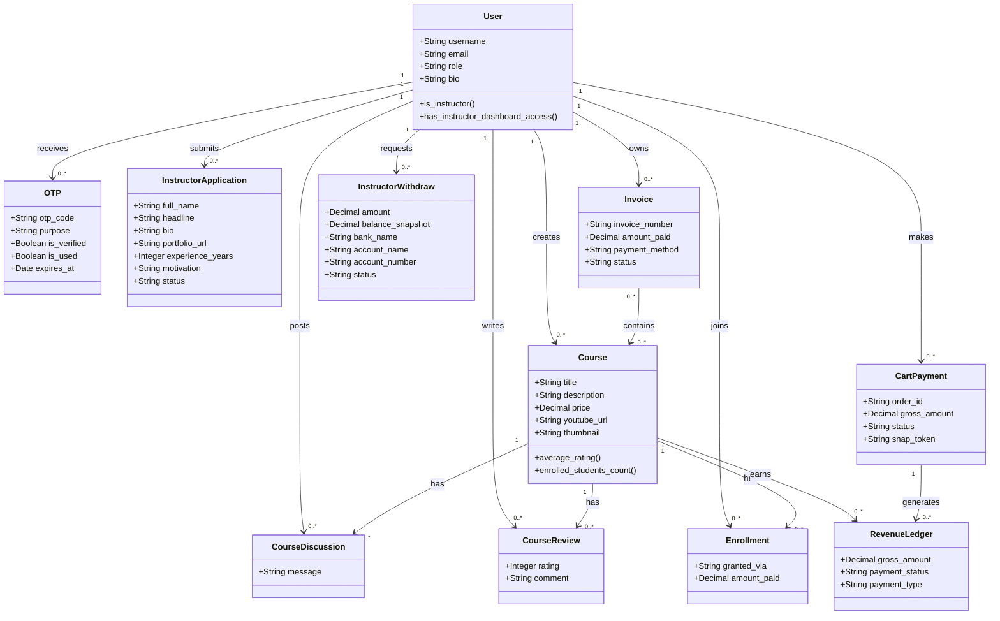
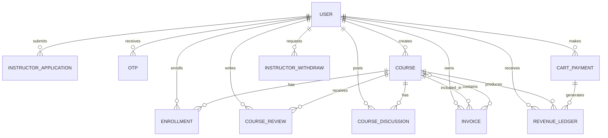

# Diagram SkillForge
## 1. Use Case Diagram

```mermaid
flowchart LR
    %% Definisi Aktor
    Student((Student))
    Instructor((Instructor))
    Admin((Admin))

    %% Batasan Sistem
    subgraph Sistem SkillForge
        UC1([Register & Login])
        UC2([Browse Course])
        UC3([Enroll Course])
        UC4([Write Review])
        UC5([Join Discussion])
        UC6([Apply as Instructor])
        UC7([Create & Manage Course])
        UC8([Manage Students])
        UC9([Review Instructor Application])
        UC10([Approve Withdrawal])
        UC11([Handle Payment])
    end

    %% Hubungan Aktor ke Use Case
    Student ---> UC1
    Student ---> UC2
    Student ---> UC3
    Student ---> UC4
    Student ---> UC5
    Student ---> UC6

    Instructor ---> UC7
    Instructor ---> UC8
    Instructor ---> UC3

    Admin ---> UC9
    Admin ---> UC10
    Admin ---> UC11

    %% Relasi Include
    UC3 .->|<< include >>| UC11
```

## 2. Activity Diagram

```mermaid
flowchart TD
    A[Student membuka halaman kursus] --> B[Memilih kursus]
    B --> C[Melihat detail kursus]
    C --> D[Klik enroll]
    D --> E{Apakah kursus gratis?}
    E -- Ya --> F[Enroll langsung diterima]
    E -- Tidak --> G[Masuk ke proses pembayaran]
    G --> H[Bayar melalui payment gateway]
    H --> I{Pembayaran berhasil?}
    I -- Ya --> J[Akses kursus diberikan]
    I -- Tidak --> K[Status pending / gagal]
    F --> J
    J --> L[Student dapat belajar, review, diskusi]
    K --> M[Student dapat mencoba ulang]
```

## 3. Sequence Diagram

```mermaid
sequenceDiagram
    participant S as Student
    participant C as Course Page
    participant P as Payment System
    participant DB as Database

    S->>C: Pilih kursus dan klik enroll
    C->>DB: Cek status kursus dan harga
    alt Kursus gratis
        DB-->>C: Akses granted
        C-->>S: Enroll berhasil
    else Kursus berbayar
        C->>P: Buat transaksi pembayaran
        P-->>C: Token pembayaran
        C-->>S: Tampilkan halaman pembayaran
        S->>P: Selesaikan pembayaran
        P-->>DB: Simpan status settlement
        DB-->>C: Akses kursus aktif
        C-->>S: Enroll berhasil
    end
```

## 4. Class Diagram

```mermaid
classDiagram
    class User {
        +String username
        +String email
        +String role
        +String bio
        +is_instructor()
        +has_instructor_dashboard_access()
    }

    class OTP {
        +String otp_code
        +String purpose
        +Boolean is_verified
        +Boolean is_used
        +Date expires_at
    }

    class InstructorApplication {
        +String full_name
        +String headline
        +String bio
        +String portfolio_url
        +Integer experience_years
        +String motivation
        +String status
    }

    class Course {
        +String title
        +String description
        +Decimal price
        +String youtube_url
        +String thumbnail
        +average_rating()
        +enrolled_students_count()
    }

    class CourseDiscussion {
        +String message
    }

    class CourseReview {
        +Integer rating
        +String comment
    }

    class Enrollment {
        +String granted_via
        +Decimal amount_paid
    }

    class CartPayment {
        +String order_id
        +Decimal gross_amount
        +String status
        +String snap_token
    }

    class Invoice {
        +String invoice_number
        +Decimal amount_paid
        +String payment_method
        +String status
    }

    class RevenueLedger {
        +Decimal gross_amount
        +String payment_status
        +String payment_type
    }

    class InstructorWithdraw {
        +Decimal amount
        +Decimal balance_snapshot
        +String bank_name
        +String account_name
        +String account_number
        +String status
    }

    User "1" --> "0..*" InstructorApplication : submits
    User "1" --> "0..*" OTP : receives
    User "1" --> "0..*" Course : creates
    User "1" --> "0..*" Enrollment : joins
    User "1" --> "0..*" CourseReview : writes
    User "1" --> "0..*" CourseDiscussion : posts
    User "1" --> "0..*" CartPayment : makes
    User "1" --> "0..*" Invoice : owns
    User "1" --> "0..*" InstructorWithdraw : requests

    Course "1" --> "0..*" CourseDiscussion : has
    Course "1" --> "0..*" CourseReview : has
    Course "1" --> "0..*" Enrollment : has
    Course "1" --> "0..*" RevenueLedger : earns

    CartPayment "1" --> "0..*" RevenueLedger : generates
    Invoice "0..*" --> "0..*" Course : contains
```

## 5. ERD

```mermaid
erDiagram
    USER ||--o{ INSTRUCTOR_APPLICATION : submits
    USER ||--o{ OTP : receives
    USER ||--o{ COURSE : creates
    USER ||--o{ ENROLLMENT : enrolls
    USER ||--o{ COURSE_REVIEW : writes
    USER ||--o{ COURSE_DISCUSSION : posts
    USER ||--o{ CART_PAYMENT : makes
    USER ||--o{ INVOICE : owns
    USER ||--o{ INSTRUCTOR_WITHDRAW : requests
    USER ||--o{ REVENUE_LEDGER : receives

    COURSE ||--o{ ENROLLMENT : has
    COURSE ||--o{ COURSE_REVIEW : receives
    COURSE ||--o{ COURSE_DISCUSSION : has
    COURSE ||--o{ INVOICE : included_in
    COURSE ||--o{ REVENUE_LEDGER : produces

    CART_PAYMENT ||--o{ REVENUE_LEDGER : generates
    INVOICE }o--o{ COURSE : contains
```