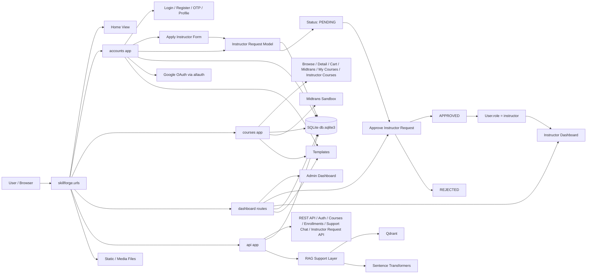
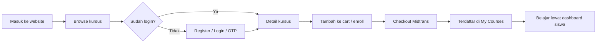

# Struktur Proyek — Ringkasan

## Ringkasan singkat
Proyek ini adalah aplikasi web berbasis Django (monorepo sederhana) untuk platform kursus online. Terdiri dari beberapa aplikasi Django: `accounts`, `courses`, `enrollments`, dan `api`. Ada integrasi REST API (Django REST Framework), otentikasi JWT, OAuth Google, dan integrasi RAG/semantic search dengan Qdrant.

## Stack utama
- Bahasa: Python 3
- Web framework: Django (>=5.0, <6.0)
- API: Django REST Framework
- Auth: django-allauth (Google OAuth), custom backend (`accounts.auth_backends`), JWT via `djangorestframework-simplejwt`
- Vector DB / RAG: Qdrant (client: `qdrant-client`) — docker compose file `docker-compose.qdrant.yml` disertakan
- Embeddings / semantic search: `sentence-transformers`
- Database default: SQLite (`db.sqlite3`) untuk pengembangan
- Storage: file system untuk `media/` dan `static/`
- Image handling: Pillow
- HTTP: requests

Dependencies terlihat di `requirements.txt`.

## Struktur folder penting (root)
- `manage.py` — entrypoint Django untuk CLI
- `skillforge/` — project Django (settings, urls, wsgi/asgi)
  - `skillforge/settings.py` — konfigurasi utama (DB, INSTALLED_APPS, REST_FRAMEWORK, env loader)
- `accounts/` — aplikasi otentikasi & model `User` kustom, views, forms, auth backends
- `courses/` — model kursus, views, template untuk tampilan web (discovery, detail, cart)
- `enrollments/` — model & logika pendaftaran/akses kursus
- `api/` — endpoint API, serializer, permissions, dukungan RAG (`support_rag.py`) dan management commands (`management/commands/`)
- `templates/` — template HTML untuk front-end server-rendered
- `static/` — aset statis (CSS/JS)
- `media/` — upload pengguna dan thumbnails
- `db.sqlite3` — database SQLite (lokal)
- `docker-compose.qdrant.yml` — konfigurasi untuk men-run Qdrant via Docker

## Project Structure (Tree)

```
skillforgecourrse/
---- manage.py                           # Django CLI entrypoint
---- requirements.txt                    # Python dependencies
---- db.sqlite3                          # SQLite database (dev)
---- docker-compose.qdrant.yml          # Qdrant vector DB config
---- README.md                          # Main project README
---- readmestructureproject.md          # This file
---- .env                               # Environment variables (git ignored)
---- .env.example                       # Example env template
----
---- skillforge/                         # Main Django project settings
-------- __init__.py
-------- settings.py                    # Settings, DB, apps, middleware, email
-------- urls.py                        # Root URL routing
-------- asgi.py                        # ASGI config
-------- wsgi.py                        # WSGI config
----
---- accounts/                          # User auth & profile app
-------- __init__.py
-------- models.py                      # Custom User model, OTP model
-------- views.py                       # Auth views (login, register, OTP, password reset)
-------- forms.py                       # Auth forms
-------- urls.py                        # Auth routes
-------- serializers.py                 # DRF serializers
-------- auth_backends.py               # Email/username auth backend
-------- adapters.py                    # Social account adapter (Google OAuth)
-------- admin.py                       # Django admin config
-------- apps.py                        # App config
-------- decorators.py                  # Custom decorators
-------- utils.py                       # Helper functions
-------- migrations/                    # DB migrations
------------ 0001_initial.py
------------ 0002_otp_and_email_constraint.py
------------ 0003_otp_purpose.py
------------ 0004_instructor_application.py
------------ 0005_remove_instructorapplication_and_user_role.py
------------ 0006_user_profile_image.py
----
---- courses/                           # Course management app
-------- __init__.py
-------- models.py                      # Course, Lesson models
-------- views.py                       # Course views (browse, detail, cart, enrollment)
-------- forms.py                       # Course forms
-------- urls.py                        # Course routes
-------- dashboard_urls.py              # Instructor dashboard routes
-------- context_processors.py          # Template context (cart count)
-------- admin.py                       # Django admin config
-------- apps.py                        # App config
-------- migrations/                    # DB migrations
------------ 0001_initial.py
------------ 0002_course_youtube_url.py
------------ 0003_remove_redeem_code_and_pricing.py
------------ 0004_course_price.py
----
---- enrollments/                       # Enrollment/subscription app
-------- __init__.py
-------- models.py                      # Enrollment model (user-course relationship)
-------- admin.py                       # Django admin config
-------- apps.py                        # App config
-------- migrations/                    # DB migrations
------------ 0001_initial.py
----
---- api/                               # REST API app (DRF)
-------- __init__.py
-------- models.py                      # API models
-------- views.py                       # API viewsets & views
-------- serializers.py                 # DRF serializers
-------- urls.py                        # API routes
-------- permissions.py                 # Custom permissions (IsOwner, IsInstructor)
-------- support_rag.py                 # RAG integration (Qdrant + embeddings)
-------- apps.py                        # App config
-------- migrations/                    # DB migrations
------------ 0001_initial.py
-------- management/
------------ commands/
---------------- seed_support_kb.py   # Seed support KB to Qdrant
---------------- sync_support_kb_qdrant.py  # Sync KB changes to Qdrant
----
---- templates/                         # HTML templates (server-rendered)
-------- base.html                      # Base template
-------- accounts/
------------ login.html
------------ register.html
------------ verify_login_otp.html
------------ verify_reset_otp.html
------------ forgot_password.html
------------ reset_password.html
------------ profile.html
-------- courses/
------------ home.html
------------ discovery.html
------------ detail.html
------------ cart.html
------------ cart_confirm.html
------------ my_courses.html
------------ student_dashboard.html
-------- dashboard/
------------ layout.html
------------ index.html
------------ manage_courses.html
------------ manage_course_form.html
------------ manage_course_confirm_delete.html
----
---- static/                            # Static files (CSS, JS, images)
-------- (CSS, JS files)
----
---- media/                             # User-uploaded media
-------- courses/
------------ thumbnails/               # Course thumbnails
-------- profiles/                      # User profile images
----
---- docs/                              # Documentation
-------- support_kb_split/              # Support KB documents (for RAG)
```

**Penjelasan folder penting:**
- `skillforge/` = Core Django project (config, routing)
- `accounts/` = User management, authentication, OTP
- `courses/` = Course CRUD, student/instructor views
- `enrollments/` = Course enrollment data
- `api/` = REST API endpoints, RAG integration
- `templates/` = HTML views (server-rendered)
- `media/` = User uploads (thumbnails, profile pics)
- `static/` = CSS, JS, frontend assets
- `migrations/` = Database schema changes (per app)

## Alur kerja / bagaimana program ini bekerja (overview)
1. Request HTTP dari pengguna (browser) diarahkan ke `skillforge.urls`.
2. Untuk halaman web, views di `courses`, `accounts`, dan `dashboard` merender template dari `templates/`.
3. Otentikasi:
   - Login/registrasi menggunakan `accounts` (email/username) dan OTP terkait.
   - Social login via Google dikonfigurasi melalui `django-allauth`.
   - API menggunakan JWT (`rest_framework_simplejwt`) dan token/session auth.
4. API:
   - `api.views` menyediakan endpoint untuk data kursus, pendaftaran, dan dukungan RAG.
   - `api/support_rag.py` berinteraksi dengan `qdrant-client` dan model embedding (`sentence-transformers`) untuk menyajikan pencarian semantik atau knowledge-base retrieval.
   - Ada command management untuk sinkronisasi knowledge base ke Qdrant (`api/management/commands/sync_support_kb_qdrant.py` dan `seed_support_kb.py`).
5. Pendaftaran kursus (enrollments) mengikat user ke kursus dan memberi akses ke konten.
6. Files dan media disimpan di folder `media/`, aset statis di `static/`.

## Mermaid Diagram

### 1) Arsitektur Website



### 2) Alur Pengguna Utama



## File konfigurasi & environment
- `.env` — project memuat variabel environment (dibaca oleh `skillforge/settings.py` via `load_env_file`).
- Variabel penting: `DJANGO_SECRET_KEY`, `DJANGO_DEBUG`, `DJANGO_ALLOWED_HOSTS`, email SMTP (EMAIL_HOST, EMAIL_HOST_USER, EMAIL_HOST_PASSWORD), `GOOGLE_OAUTH_CLIENT_ID`, `GOOGLE_OAUTH_CLIENT_SECRET`, `DJANGO_EMAIL_BACKEND`.

## Cara menjalankan lokal (pengembangan)
1. Buat virtual environment dan install dependencies:

```bash
python -m venv .venv
source .venv/bin/activate
pip install -r requirements.txt
```

2. Siapkan environment (contoh `.env` minimal):

```
DJANGO_DEBUG=true
DJANGO_SECRET_KEY=change-me
DJANGO_ALLOWED_HOSTS=localhost,127.0.0.1
```

3. Jalankan migrasi dan buat superuser:

```bash
python manage.py migrate
python manage.py createsuperuser
```

4. (Opsional) Jalankan Qdrant untuk fitur RAG/semantic search:

```bash
docker compose -f docker-compose.qdrant.yml up -d
```

5. Sinkronisasi atau seed support KB (jika perlu):

```bash
python manage.py seed_support_kb
python manage.py sync_support_kb_qdrant
```

6. Jalankan server pengembangan:

```bash
python manage.py runserver
```

## Perhatian & catatan
- Database default adalah SQLite, cocok untuk dev; ganti ke Postgres/MySQL untuk produksi.
- Email: bila SMTP tidak dikonfigurasi, backend konsol digunakan (lihat `settings.py`).
- OAuth: untuk Social login, isi `GOOGLE_OAUTH_CLIENT_ID` dan `GOOGLE_OAUTH_CLIENT_SECRET`.
- Qdrant & embeddings: fitur RAG membutuhkan Qdrant berjalan dan library `sentence-transformers` tersedia — perhatikan penggunaan memori saat meload model.

## Lokasi kode penting (quick map)
- Otentikasi dan model user: `accounts/models.py`, `accounts/auth_backends.py`, `accounts/views.py`
- Kursus + templates: `courses/models.py`, `courses/views.py`, `templates/courses/`
- Enrollments: `enrollments/models.py`
- API & RAG: `api/serializers.py`, `api/views.py`, `api/support_rag.py`, `api/management/commands/`
- Settings & env loading: `skillforge/settings.py`

---

## Routes / URL Structure

### Root Routes (`skillforge/urls.py`)
| URL | Deskripsi |
|-----|-----------|
| `/` | Home page |
| `/admin/` | Django admin panel |
| `/oauth/` | Social login (Google via django-allauth) |
| `/accounts/` | User auth routes (lihat di bawah) |
| `/dashboard/` | Instructor/admin dashboard routes |
| `/courses/` | Course browsing & student dashboard |
| `/api/` | REST API endpoints |
| `/media/` | Media files (DEBUG only) |

---

### Accounts Routes (`accounts/urls.py`)
**Prefix:** `/accounts/`

| URL | Method | Deskripsi |
|-----|--------|-----------|
| `register/` | GET, POST | Registrasi user baru |
| `login/` | GET, POST | Login dengan email/username |
| `verify-login-otp/` | GET, POST | Verifikasi OTP login |
| `resend-login-otp/` | POST | Kirim ulang OTP login |
| `forgot-password/` | GET, POST | Request reset password |
| `verify-reset-otp/` | GET, POST | Verifikasi OTP reset password |
| `reset-password/` | GET, POST | Set password baru |
| `logout/` | GET | Logout user |
| `profile/` | GET, POST | Tampil & edit profil user |

**Contoh:** `/accounts/login/`, `/accounts/register/`, `/accounts/profile/`

---

### Courses Routes (`courses/urls.py`)
**Prefix:** `/courses/`

#### Public / Student
| URL | Method | Deskripsi |
|-----|--------|-----------|
| (root) | GET | Redirect ke browse |
| `browse/` | GET | Discovery/browse semua kursus |
| `courses/<id>/` | GET | Detail kursus (info, deskripsi, instructor) |
| `courses/<id>/add-to-cart/` | POST | Tambah ke shopping cart |
| `courses/<id>/enroll/` | POST | Langsung enroll (jika gratis) |

#### Student Dashboard / Cart
| URL | Method | Deskripsi |
|-----|--------|-----------|
| `dashboard/student/` | GET | Student dashboard |
| `dashboard/cart/` | GET | Lihat shopping cart |
| `dashboard/cart/confirm/` | POST | Konfirmasi & beli kursus |
| `dashboard/cart/<id>/remove/` | POST | Hapus dari cart |
| `dashboard/history/` | GET | Riwayat transaksi |
| `dashboard/my-courses/` | GET | Kursus yang sudah dibeli |

#### Instructor / Admin (Manage Courses)
| URL | Method | Deskripsi |
|-----|--------|-----------|
| `manage/courses/` | GET | List semua kursus (admin) |
| `manage/courses/add/` | GET, POST | Buat kursus baru |
| `manage/courses/<id>/edit/` | GET, POST | Edit kursus |
| `manage/courses/<id>/delete/` | POST | Hapus kursus |
| `dashboard/` | GET | Admin dashboard |

**Contoh:** `/courses/browse/`, `/courses/courses/1/`, `/courses/dashboard/cart/`, `/courses/manage/courses/add/`

---

### Dashboard Routes (`courses/dashboard_urls.py`)
**Prefix:** `/dashboard/`

| URL | Method | Deskripsi |
|-----|--------|-----------|
| (root) | GET | Dashboard index (admin dashboard) |
| `manage/courses/` | GET | List kursus (instructor/admin) |
| `manage/courses/add/` | GET, POST | Buat kursus |
| `manage/courses/<id>/edit/` | GET, POST | Edit kursus |
| `manage/courses/<id>/delete/` | POST | Hapus kursus |

**Catatan:** Routes ini di-include di `/dashboard/` dan juga tersedia di `/courses/` untuk compatibility.

---

### API Routes (`api/urls.py`)
**Prefix:** `/api/` — REST JSON API dengan JWT auth

#### Authentication
| URL | Method | Deskripsi | Auth |
|-----|--------|-----------|------|
| `auth/register/` | POST | Register user | ❌ |
| `auth/login/` | POST | Login, dapatkan tokens | ❌ |
| `auth/logout/` | POST | Logout | ✅ JWT |
| `auth/me/` | GET | Data user yang login | ✅ JWT |
| `login/` | POST | Alternatif login (legacy) | ❌ |
| `forgot-password/` | POST | Request password reset | ❌ |
| `verify-otp/` | POST | Verifikasi OTP umum | ❌ |
| `reset-password/` | POST | Reset password dengan OTP | ❌ |
| `resend-otp/` | POST | Kirim ulang OTP | ❌ |
| `login/verify-otp/` | POST | Verifikasi OTP login | ❌ |

#### Courses (ViewSet)
| URL | Method | Deskripsi | Auth |
|-----|--------|-----------|------|
| `courses/` | GET | List semua kursus | ❌ |
| `courses/<id>/` | GET | Detail kursus | ❌ |
| `courses/` | POST | Buat kursus | ✅ Admin |
| `courses/<id>/` | PUT/PATCH | Update kursus | ✅ Admin |
| `courses/<id>/` | DELETE | Hapus kursus | ✅ Admin |

#### Enrollments (ViewSet)
| URL | Method | Deskripsi | Auth |
|-----|--------|-----------|------|
| `enrollments/` | GET | List enrollments (user) | ✅ JWT |
| `enrollments/` | POST | Buat enrollment | ✅ JWT |
| `enrollments/<id>/` | GET | Detail enrollment | ✅ JWT |
| `enrollments/<id>/` | PUT/PATCH | Update enrollment | ✅ Admin |
| `enrollments/<id>/` | DELETE | Hapus enrollment | ✅ Admin |

#### Support / RAG
| URL | Method | Deskripsi | Auth |
|-----|--------|-----------|------|
| `support/knowledge/` | GET | List support documents | ❌ |
| `support/knowledge/<id>/` | GET | Detail document | ❌ |
| `support/chat/` | POST | Chat dengan RAG support bot | ✅ JWT |

**Contoh:**
```
GET /api/courses/                    → list semua kursus
GET /api/courses/5/                  → detail kursus ID 5
POST /api/auth/register/             → register
POST /api/auth/login/                → login, dapatkan access_token & refresh_token
POST /api/auth/logout/               → logout
GET /api/auth/me/ (header: Authorization: Bearer <access_token>) → user saat ini
POST /api/enrollments/               → enroll ke kursus
GET /api/support/chat/               → support RAG chat
```

**JWT Token:** Didapatkan dari login, durasi:
- Access token: 15 menit
- Refresh token: 7 hari

---

### URL Naming Convention & Namespace
- Template menggunakan Django `` tag dengan namespace: `accounts:login`, `courses:discovery`, `api-courses-list`, dll.
- Setiap aplikasi memiliki `app_name` di `urls.py` untuk namespace.
- Contoh redirect: `LOGIN_URL = "accounts:login"` di settings.

---

Jika Anda mau, saya bisa:
- Menambahkan instruksi deployment singkat (Gunicorn + Nginx atau Heroku/Docker)
- Membuat contoh `.env.example`
- Menyusun checklist untuk produksi (migrasi DB, staticfiles, keamanan)

Sebutkan pilihan yang Anda inginkan.